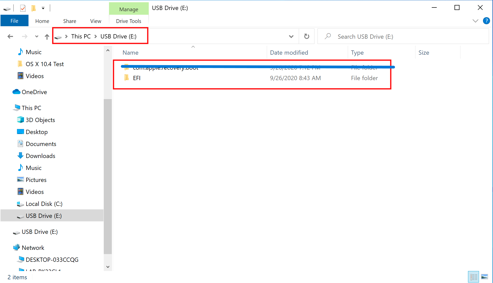

# 在Windows中制作安装程序

虽然你不需要重新安装macOS来使用OpenCore，但有些用户更喜欢在启动管理器升级时使用新的版本。

首先，您需要以下内容：

* 4GB USB

* 对于大于16GB的USB进行FAT32格式化使用[Rufus方法](#rufus方法)

* [macrecovery.py](https://github.com/acidanthera/OpenCorePkg/releases)
  * 这需要[已安装的Python 3](https://www.python.org/downloads/)

## Downloading macOS

要获取旧的安装程序非常容易，首先获取[OpenCorePkg](https://github.com/acidanthera/OpenCorePkg/releases)的副本，然后转到`/Utilities/macrecovery/`。接下来，单击当前文件夹路径旁边的，并键入`cmd`，在当前目录中打开命令提示符:


现在根据你想要的macOS版本运行以下其中一个（注意这些脚本依赖于[Python 3](https://www.python.org/downloads/)支持，如果你还没有安装，请安装）：

```sh
# Lion (10.7):
python3 macrecovery.py -b Mac-2E6FAB96566FE58C -m 00000000000F25Y00 download
python3 macrecovery.py -b Mac-C3EC7CD22292981F -m 00000000000F0HM00 download

# Mountain Lion (10.8):
python3 macrecovery.py -b Mac-7DF2A3B5E5D671ED -m 00000000000F65100 download

# Mavericks (10.9):
python3 macrecovery.py -b Mac-F60DEB81FF30ACF6 -m 00000000000FNN100 download

# Yosemite (10.10):
python3 macrecovery.py -b Mac-E43C1C25D4880AD6 -m 00000000000GDVW00 download

# El Capitan (10.11):
python3 macrecovery.py -b Mac-FFE5EF870D7BA81A -m 00000000000GQRX00 download

# Sierra (10.12):
python3 macrecovery.py -b Mac-77F17D7DA9285301 -m 00000000000J0DX00 download

# High Sierra (10.13)
python3 macrecovery.py -b Mac-7BA5B2D9E42DDD94 -m 00000000000J80300 download
python3 macrecovery.py -b Mac-BE088AF8C5EB4FA2 -m 00000000000J80300 download

# Mojave (10.14)
python3 macrecovery.py -b Mac-7BA5B2DFE22DDD8C -m 00000000000KXPG00 download

# Catalina (10.15)
python3 macrecovery.py -b Mac-00BE6ED71E35EB86 -m 00000000000000000 download

# Big Sur (11)
python3 macrecovery.py -b Mac-42FD25EABCABB274 -m 00000000000000000 download

# Monterey (12)
python3 macrecovery.py -b Mac-FFE5EF870D7BA81A -m 00000000000000000 download

# Latest version
# ie. Ventura (13)
python3 macrecovery.py -b Mac-4B682C642B45593E -m 00000000000000000 download
```

* **macOS 12及以上注释**:由于最近的macOS版本引入了对USB堆栈的更改，建议您在安装macOS之前映射USB端口(使用USBToolBox)。
  * <span style="color:red"> 警告： </span> 在macOS 11.3及更新版本中，[XhciPortLimit被损坏导致启动循环](https://github.com/dortania/bugtracker/issues/162)。
    * 如果你已经[映射你的USB端口](https://xuanxuan1231.github.io/OpenCore-Post-Install/usb/)并禁用`XhciPortLimit`，你在启动macOS 11.3+时不会出现问题。

这将需要一些时间，但是一旦你完成，你应该得到BaseSystem或RecoveryImage文件:


| BaseSystem | RecoveryImage |
| :--- | :--- |
| |  |

现在我们下载了安装程序，接下来我们要格式化我们的USB。

## 制作安装程序

在这里，我们将格式化我们的USB并添加macOS，我们有3个选项：

* [磁盘管理方法](#磁盘管理方法)
  * 基于GUI，最简单的方法
  * 仅支持UEFI系统（2012+）
* [Rufus方法](#rufus方法)
  * 基于GUI，最简单的方法
  * 对于更大的USB驱动器（16GB+）
* [diskpart方法](#diskpart方法)
  * 基于命令行，稍微多做一些工作
  * 旧版系统需要（非UEFI，2012前）

### 磁盘管理方法

只需打开磁盘管理，并将USB格式化为FAT32:

1. 右键单击任务栏上的`开始`按钮（或按<kbd>Win</kbd>+<kbd>X</kbd>），选择“磁盘管理”。
2. 您应该看到所有的分区和磁盘。在下半部分，你会看到你的设备。找到你的USB。
3. 您需要将USB格式化为FAT32分区（不需要全部）。

* 如果你在USB上有多个分区，右键单击每个分区，然后单击删除USB卷（这将删除数据，确保你有备份，只从USB上删除分区）
  * 右键单击未分配的空间并创建一个新的简单卷。确保它是FAT32的，并且至少有1到2gb。命名为“EFI”。
* 否则，右键单击USB上的分区，单击“格式化”，将其设置为FAT32。


~~接下来，进入USB驱动器的根目录，创建一个名为`com.apple.recovery.boot`的文件夹。然后移动下载的BaseSystem或RecoveryImage文件。请确保将.dmg和.chunklist文件拷贝到此文件夹：~~
::: details 其他信息
acidanthera更新了OpenCorePkg中的macrecovery.py，现在它可以自动创建`com.apple.recovery.boot`文件夹并将.dmg和.chunklist文件放入。你可以直接将`com.apple.recovery.boot`文件夹放入EFI USB。
:::


现在解压缩你之前下载的OpenCorePkg并打开它:


这里我们看到IA32（32位cpu）和X64（64位cpu）文件夹，选择最适合您的硬件并打开它。接下来抓住里面的EFI文件夹，并把它放在USB驱动器的根目录上，~~旁边是com.apple.recovery.boot~~。完成后应该是这样的:

::: details 其他信息
acidanthera更新了OpenCorePkg中的macrecovery.py，现在它可以自动创建`com.apple.recovery.boot`文件夹并将.dmg和.chunklist文件放入。你可以直接将`com.apple.recovery.boot`文件夹放入EFI USB。所以此处应该显示为：

:::

### Rufus方法

1. 下载[Rufus](https://rufus.ie/zh/)
2. 将BOOT选项设置为不可引导
3. 将文件系统设置为FAT32
4. 单击“开始”
5. 删除USB驱动器分区中autorun的所有文件


~~接下来，进入USB驱动器的根目录，创建一个名为`com.apple.recovery.boot`的文件夹。然后移动下载的BaseSystem或RecoveryImage文件。请确保将.dmg和.chunklist文件拷贝到此文件夹：~~
::: details 其他信息
acidanthera更新了OpenCorePkg中的macrecovery.py，现在它可以自动创建`com.apple.recovery.boot`文件夹并将.dmg和.chunklist文件放入。你可以直接将`com.apple.recovery.boot`文件夹放入EFI USB。
:::


现在解压缩你之前下载的OpenCorePkg并打开它:


这里我们看到IA32（32位cpu）和X64（64位cpu）文件夹，选择最适合您的硬件并打开它。接下来抓住里面的EFI文件夹，并把它放在USB驱动器的根目录上，~~旁边是com.apple.recovery.boot~~。完成后应该是这样的:

::: details 其他信息
acidanthera更新了OpenCorePkg中的macrecovery.py，现在它可以自动创建`com.apple.recovery.boot`文件夹并将.dmg和.chunklist文件放入。你可以直接将`com.apple.recovery.boot`文件夹放入EFI USB。所以此处应该显示为：

:::

### diskpart方法

::: details diskpart方法

按下<kbd>Windows</kbd>+<kbd>R</kbd>

现在运行以下命令：

```sh
# List available disks
list disk
# Select your disk(ie. disk 1)
select disk 1
# Format the drive
clean
# Convert to GPT
# Due to an odd bug with BOOTICE and DuetPkg, MBR disks will fail to boot
convert gpt
# Create a new partition
create partition primary
# Select your partition
# Running clean ensures we only have 1 partition so it will be "partition 1"
select partition 1
# Format the drive as FAT32
format fs=fat32 quick
# Assign a drive letter(ie. Drive E, ensure it's not currently in use)
ASSIGN LETTER=E
```

~~接下来，进入USB驱动器的根目录，创建一个名为`com.apple.recovery.boot`的文件夹。然后移动下载的BaseSystem或RecoveryImage文件。请确保将.dmg和.chunklist文件拷贝到此文件夹：~~
::: details 其他信息
acidanthera更新了OpenCorePkg中的macrecovery.py，现在它可以自动创建`com.apple.recovery.boot`文件夹并将.dmg和.chunklist文件放入。你可以直接将`com.apple.recovery.boot`文件夹放入EFI USB。
:::


现在解压缩你之前下载的OpenCorePkg并打开它:


这里我们看到IA32（32位cpu）和X64（64位cpu）文件夹，选择最适合您的硬件并打开它。接下来抓住里面的EFI文件夹，并把它放在USB驱动器的根目录上，~~旁边是com.apple.recovery.boot~~。完成后应该是这样的:

::: details 其他信息
acidanthera更新了OpenCorePkg中的macrecovery.py，现在它可以自动创建`com.apple.recovery.boot`文件夹并将.dmg和.chunklist文件放入。你可以直接将`com.apple.recovery.boot`文件夹放入EFI USB。所以此处应该显示为：

:::

::: details 旧版安装设置

如果您的固件不支持UEFI，请参见以下说明：

首先，您需要以下内容：

* [7-Zip](https://sparanoid.com/lab/7z/)
* [BOOTICE](https://www.majorgeeks.com/files/details/bootice_64_bit.html)
* [OpenCorePkg](https://github.com/acidanthera/OpenCorePkg/releases)

接下来，打开BOOTICE并确保您选择了正确的驱动器。


接下来，进入“Process MBR”，然后选择“Restore MBR”，从OpenCorePkg的`Utilities/LegacyBoot/`中选择**boot0**文件:

| Restore MBR | Restore boot0 file |
| :--- | :--- |
|  |  |

然后返回主屏幕，选择“Process PBR”，然后选择“Restore PBR”。从这里，从OpenCorePkg的`Utilities/LegacyBoot/`中选择**boot1f32**文件:

| Restore PBR | Restore boot1f32 file |
| :--- | :--- |
|  |  |

完成后，回到USB，做最后一件事。从`Utilities/LegacyBoot/`中获取**bootx64**（64位cpu）或**bootia32**（32位cpu）文件并将其放在驱动器的根目录上。**重命名该文件为boot**，以确保DuetPkg可以正确：


:::

## 现在，所有这些都完成了，转到[设置EFI](./opencore-efi.md)来完成您的工作
